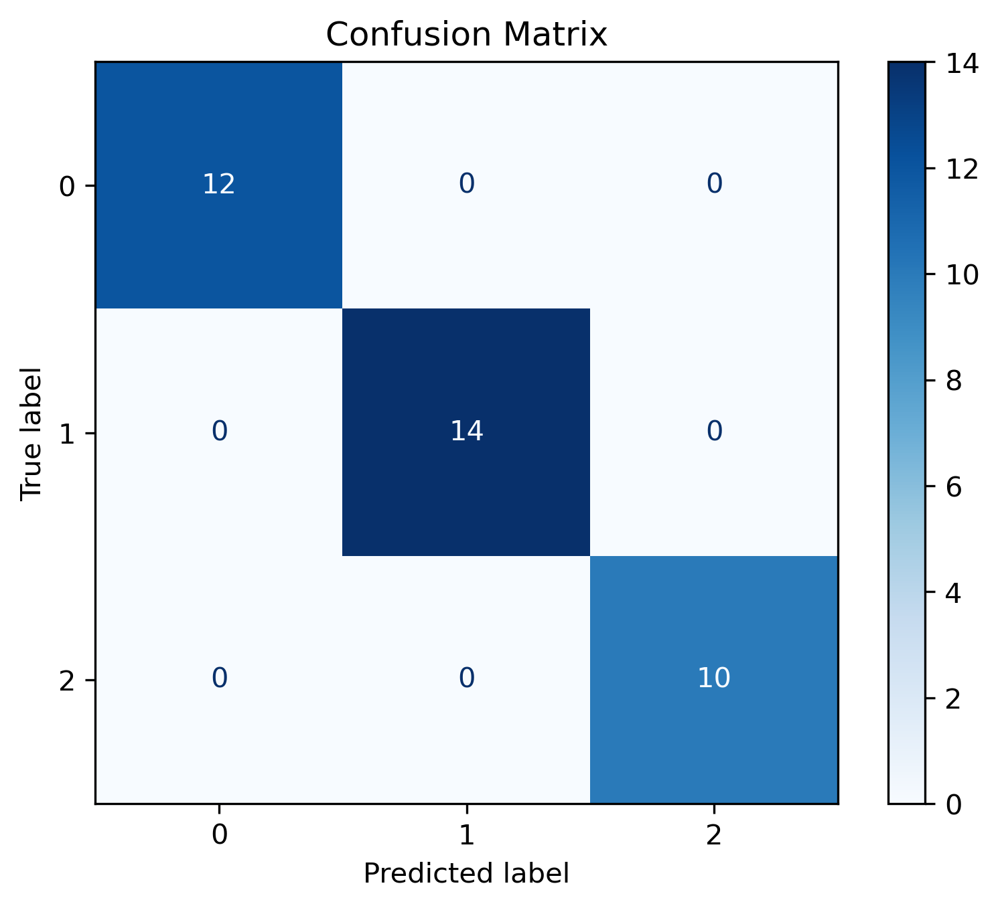
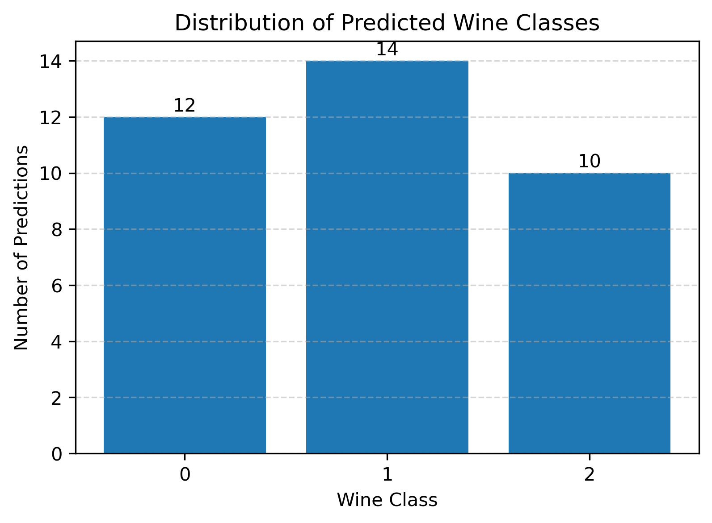
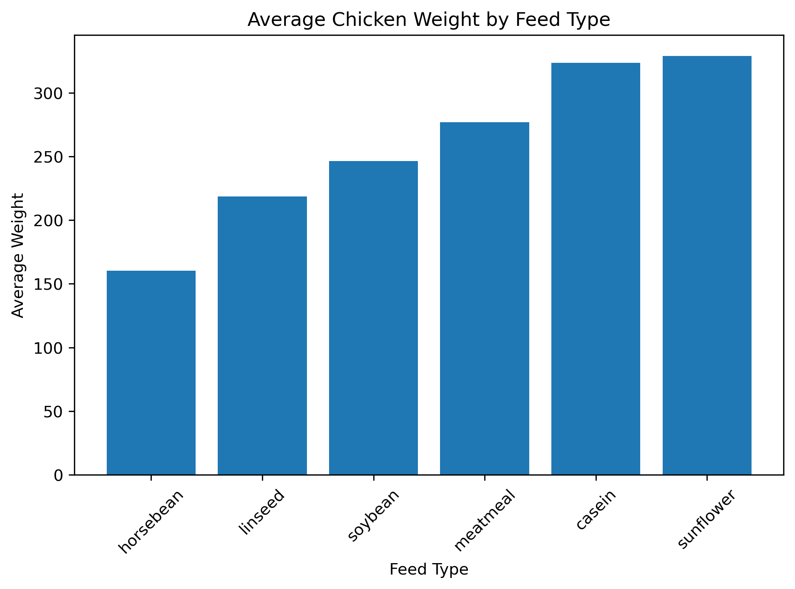
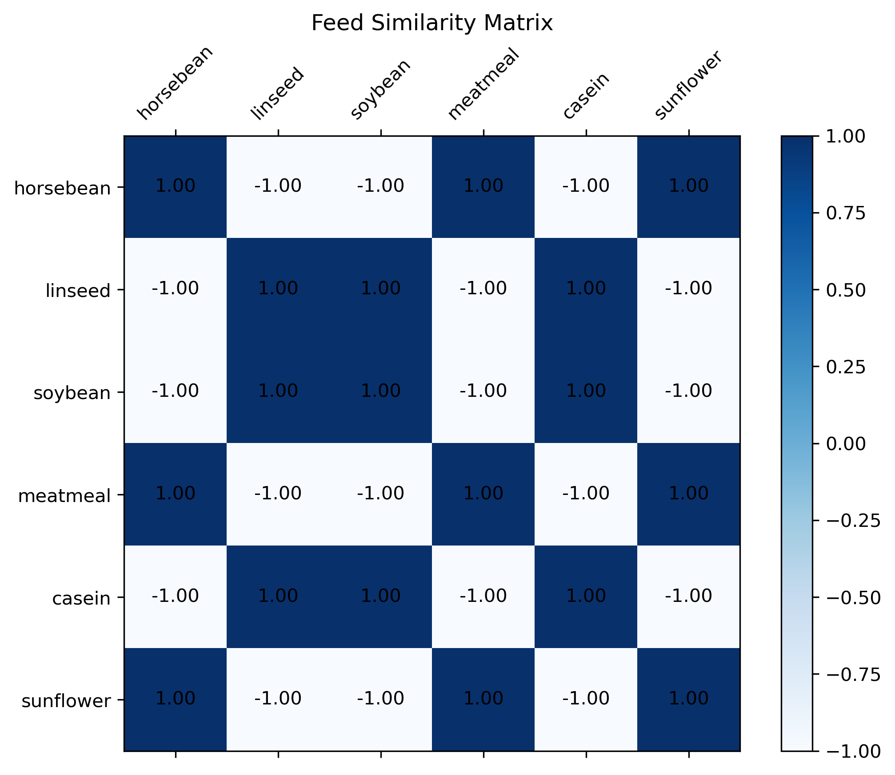
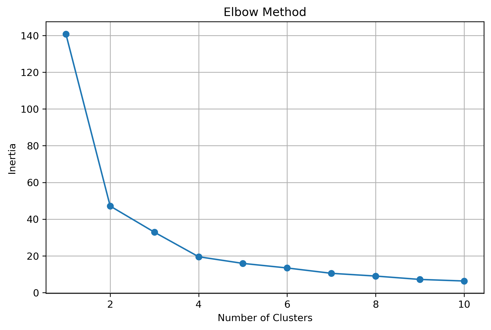
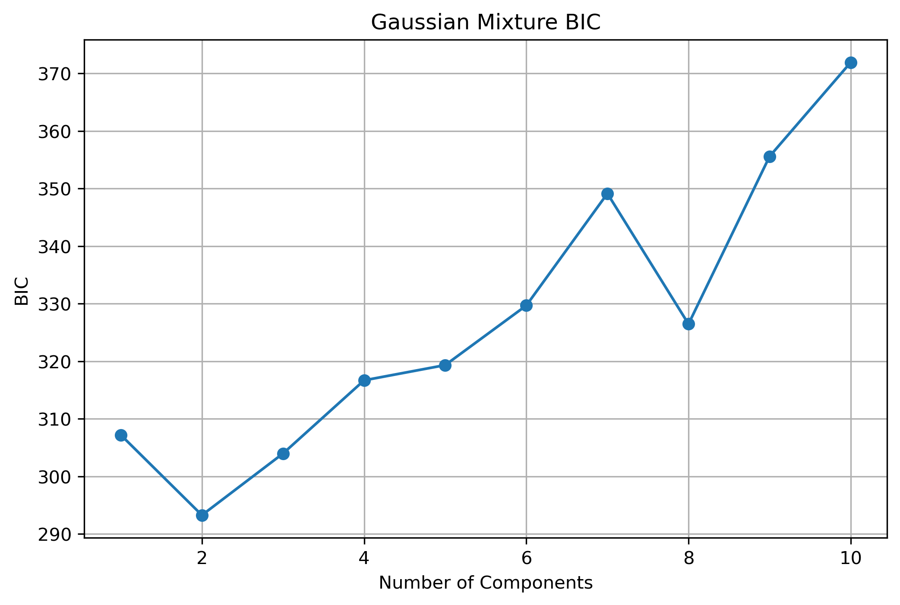
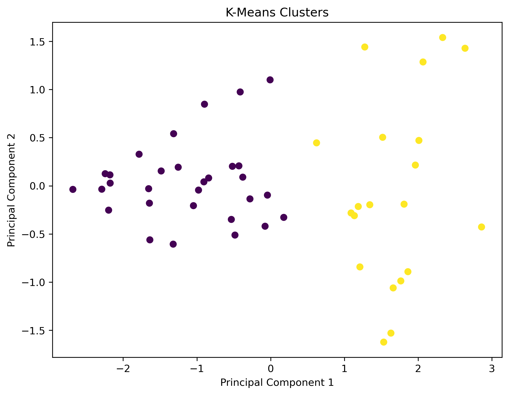
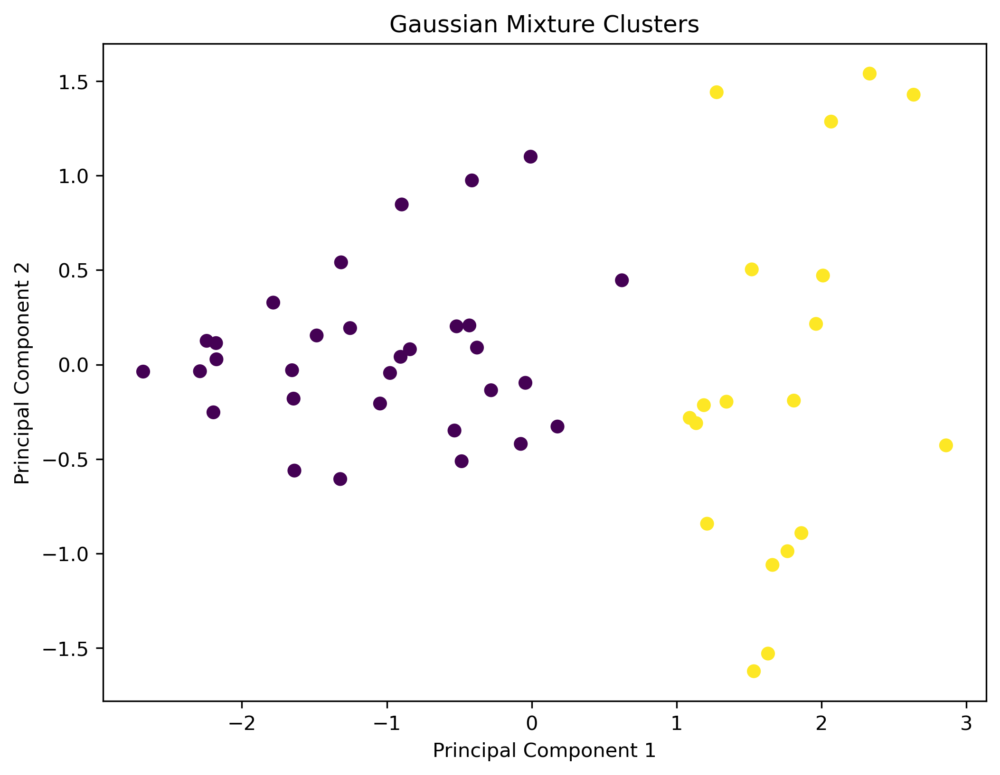

# Machine Learning Applications with PCA

## Overview

This project demonstrates the complete machine learning workflow by solving three real-world business problems using classification, recommendation systems, and clustering techniques.

The project covers:

- Data preparation and cleaning
- Feature scaling
- Principal Component Analysis (PCA)
- Hyperparameter tuning
- Classification
- Recommendation Systems
- Clustering
- Model evaluation
- Data visualization
- Business interpretation

---

# Project 1: Wine Classification

## Business Problem

A premium wine distributor needs to automatically classify wines based on their chemical properties for inventory management and quality control.

## Machine Learning Workflow

- Data Cleaning
- StandardScaler
- PCA
- GridSearchCV
- k-Nearest Neighbors (k-NN)

## Results

- Accuracy: **100%**
- PCA retained **96.29%** of the original information.

### Confusion Matrix



### Predicted Wine Classes



---

# Project 2: Feed Recommendation System

## Business Problem

Recommend similar livestock feeds using chicken growth performance.

## Machine Learning Workflow

- Data Cleaning
- StandardScaler
- PCA
- Cosine Similarity

## Results

The recommendation system successfully identified feed types with similar performance characteristics.

### Average Feed Performance



### Feed Similarity Matrix



---

# Project 3: Crime Pattern Clustering

## Business Problem

Identify patterns in crime statistics across U.S. states to support public policy research.

## Machine Learning Workflow

- StandardScaler
- Feature Selection
- PCA
- K-Means
- Gaussian Mixture Model
- Elbow Method
- Bayesian Information Criterion (BIC)

## Results

PCA retained **93.89%** of the dataset variance.

Both K-Means and GMM identified **2 natural crime clusters**.

### Elbow Method



### Bayesian Information Criterion



### K-Means Clustering



### Gaussian Mixture Model



---

# Repository Structure

```text
machine-learning-pca-lab/
│
├── notebooks/
│   ├── 01_Wine_Classification.ipynb
│   ├── 02_Feed_Recommendation.ipynb
│   └── 03_Crime_Clustering.ipynb
│
├── images/
│   ├── confusion_matrix.png
│   ├── class_distribution.png
│   ├── feed_weights.png
│   ├── feed_similarity.png
│   ├── elbow_method.png
│   ├── bic_curve.png
│   ├── kmeans_clusters.png
│   └── gmm_clusters.png
│
├── reports/
│
├── README.md
├── requirements.txt
└── .gitignore
```

---

# Technologies Used

- Python
- Pandas
- NumPy
- Matplotlib
- Scikit-learn
- Pydataset
- Jupyter Notebook

---

# Installation

Clone the repository:

```bash
git clone https://github.com/YOUR_USERNAME/machine-learning-pca-lab.git
```

Navigate to the project:

```bash
cd machine-learning-pca-lab
```

Install dependencies:

```bash
pip install -r requirements.txt
```

Launch Jupyter Notebook:

```bash
jupyter notebook
```

---

# Key Results

| Project | Outcome |
|---------|---------|
| Wine Classification | 100% Classification Accuracy |
| Feed Recommendation | Successfully recommended similar feed types |
| Crime Clustering | Identified two distinct crime clusters |

---

# Future Improvements

- Deploy the models as web applications.
- Add interactive dashboards.
- Train on larger, real-world datasets.
- Compare additional machine learning algorithms.

---

# Author

**Your Name**

Data Scientist | Machine Learning Engineer | AI Engineer
